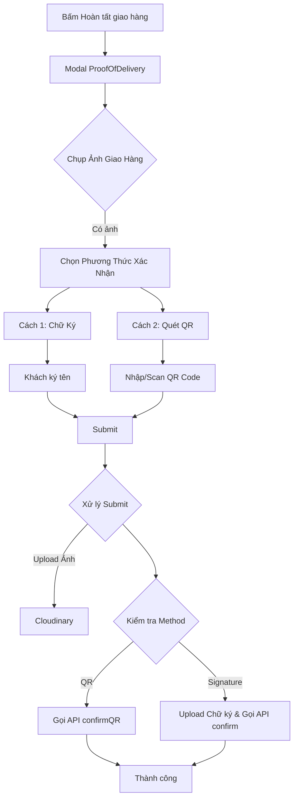

# Cập nhật Luồng Giao Hàng - Bằng Chứng Giao Hàng

## Tổng quan
Đã thiết kế lại luồng hoàn tất giao hàng để hỗ trợ 2 phương thức xác nhận linh hoạt cho khách hàng: **Ký tên trực tiếp** hoặc **Quét mã QR**. Shipper bắt buộc phải có ảnh giao hàng và một trong hai loại xác nhận này.

## Các thay đổi chính

### 1. ProofOfDelivery Component (`components/delivery/ProofOfDelivery.js`)

#### Validation:
- **Ảnh giao hàng**: BẮT BUỘC trong mọi trường hợp.
- **Xác nhận khách hàng**: BẮT BUỘC chọn 1 trong 2:
  1. **Chữ ký**: Khách hàng ký trên màn hình.
  2. **Mã QR**: Shipper quét/nhập mã QR của đơn hàng.

#### Giao diện mới:
- Thêm phần chọn phương thức xác nhận (Tabs/Buttons).
- Modal nhập/quét mã QR.
- Hiển thị preview cho chữ ký hoặc mã QR đã quét.
- Cho phép thay đổi phương thức xác nhận linh hoạt.

### 2. Delivery Service (`service/delivery/index.js`)

#### API:
```javascript
// 1. Xác nhận bằng Chữ ký (Truyền thống)
confirmDeliveryAssignment({
  orderId: number,
  deliveryPhotos: [string], // URL ảnh giao hàng
  deliveryNotes: string     // Ghi chú
})

// 2. Xác nhận bằng QR Code
confirmDeliveryAssignmentQRScan({
  qrCode: string,           // Mã QR đã quét
  customerSignature: null   // Không cần chữ ký nếu dùng QR
})
```

### 3. Delivery Dashboard (`app/(delivery)/delivery.js`)

#### Luồng xử lý `handleProofSubmit`:

**Bước 1: Upload Ảnh**
- Luôn upload ảnh giao hàng lên Cloudinary trước.

**Bước 2: Kiểm tra phương thức xác nhận**

*   **Trường hợp A: Dùng QR Code**
    - Gọi `confirmDeliveryAssignmentQRScan`
    - Payload: `{ qrCode: scannedQR }`

*   **Trường hợp B: Dùng Chữ ký**
    - Upload chữ ký lên Cloudinary
    - Gọi `confirmDeliveryAssignment`
    - Payload: `{ orderId, deliveryPhotos, deliveryNotes }` (Backend sẽ lấy chữ ký từ logic cũ hoặc cập nhật API nếu cần, hiện tại flow này dùng API confirm thường).

## Luồng hoạt động chi tiết



## Testing Checklist

- [ ] **Validation Ảnh**: Không thể submit nếu thiếu ảnh.
- [ ] **Validation Method**: Không thể submit nếu chưa ký HOẶC chưa có QR.
- [ ] **Flow Chữ ký**:
    - Vẽ chữ ký -> Submit -> Upload ảnh & chữ ký -> API thành công.
- [ ] **Flow QR**:
    - Nhập QR -> Submit -> Upload ảnh -> API QR thành công.
- [ ] **Chuyển đổi**: Có thể đổi từ Chữ ký sang QR và ngược lại trước khi submit.
- [ ] **Giao diện**: Hiển thị đúng trạng thái loading, lỗi, và thông báo thành công.
